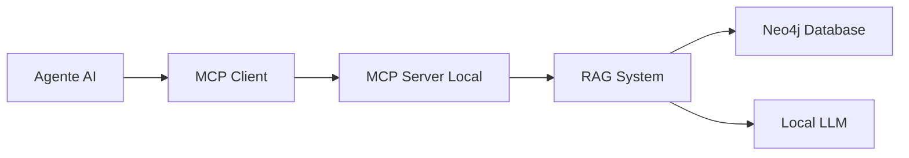
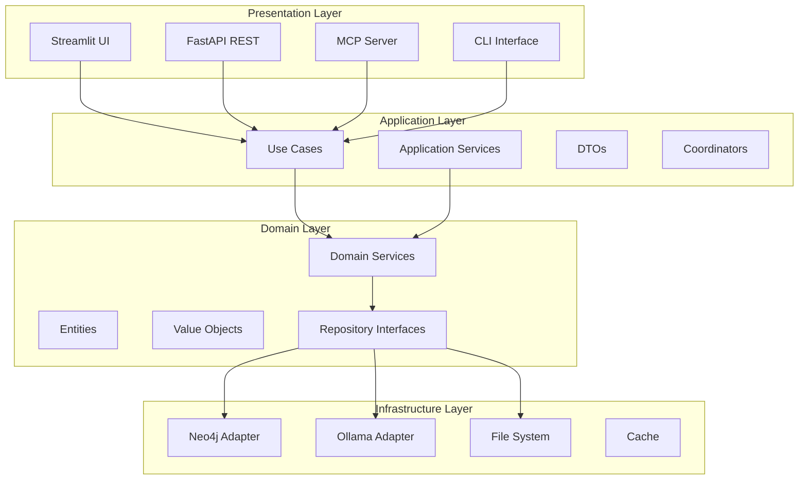
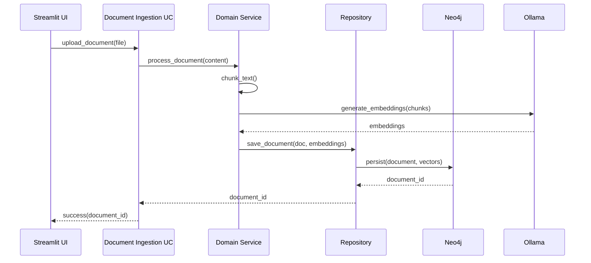
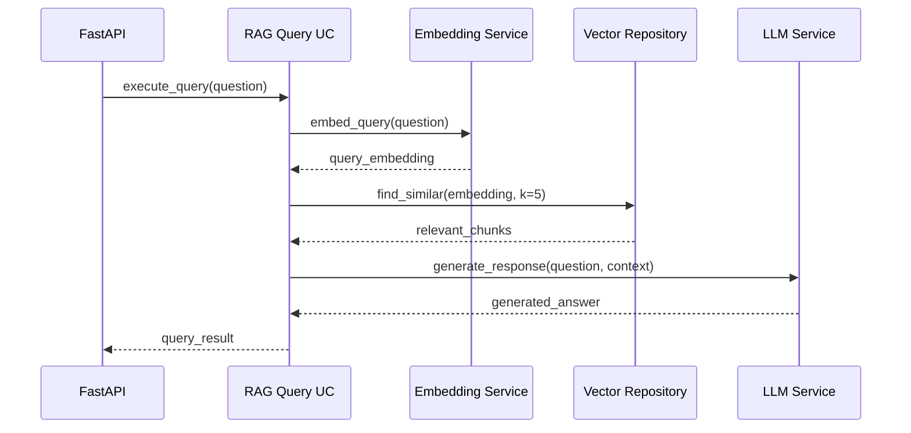

# Sistema RAG Local com Python, LangChain e Neo4j

## Visão Geral

Este projeto implementa um sistema de Retrieval-Augmented Generation (RAG) local usando Python, LangChain e Neo4j como banco de dados vetorial e de grafos. O sistema permite ingestão, indexação e recuperação de documentos para gerar respostas contextualizadas usando modelos de linguagem.

## Arquitetura do Sistema

```
┌─────────────────┐    ┌─────────────────┐    ┌─────────────────┐
│   Documentos    │    │   Processamento │    │   Armazenamento │
│                 │    │                 │    │                 │
│ • PDFs          │───▶│ • Text Splitter │───▶│ • Neo4j         │
│ • TXTs          │    │ • Embeddings    │    │ • Vetores       │
│ • Webpages      │    │ • Metadados     │    │ • Relacionamentos│
│ • APIs          │    │                 │    │                 │
└─────────────────┘    └─────────────────┘    └─────────────────┘
                                                       │
┌─────────────────┐    ┌─────────────────┐           │
│   Interface     │    │   Geração       │           │
│                 │    │                 │           │
│ • API REST      │◀───│ • LLM Local     │◀──────────┘
│ • Streamlit UI  │    │ • Prompt Eng.   │
│ • CLI           │    │ • Context       │
│ • MCP Server    │    │                 │
└─────────────────┘    └─────────────────┘
```

## Componentes Principais

### 1. Módulo de Ingestão (`ingestion/`)
- **Document Loaders**: Carregamento de diferentes tipos de documentos
- **Text Splitters**: Divisão inteligente de documentos em chunks
- **Metadata Extractors**: Extração de metadados relevantes

### 2. Módulo de Embedding (`embedding/`)
- **Embedding Models**: Modelos locais para vetorização (sentence-transformers)
- **Vector Store**: Interface com Neo4j para armazenamento de vetores
- **Similarity Search**: Busca por similaridade semântica

### 3. Módulo de Retrieval (`retrieval/`)
- **Semantic Search**: Busca semântica usando embeddings
- **Graph Traversal**: Navegação por relacionamentos no Neo4j
- **Hybrid Search**: Combinação de busca vetorial e de grafos
- **Re-ranking**: Refinamento dos resultados recuperados

### 4. Módulo de Generation (`generation/`)
- **LLM Integration**: Interface com modelos locais (Ollama, llama.cpp)
- **Prompt Templates**: Templates otimizados para RAG
- **Context Management**: Gerenciamento de contexto e memória
- **Response Synthesis**: Síntese de respostas baseadas no contexto

### 5. Base de Dados (`database/`)
- **Neo4j Setup**: Configuração e inicialização do banco
- **Schema Definition**: Definição de nós e relacionamentos
- **Query Interface**: Interface para consultas Cypher
- **Vector Indexing**: Configuração de índices vetoriais

## Fluxo de Dados

### Ingestão de Documentos
1. **Upload/Input** → Recebimento de documentos
2. **Parsing** → Extração de texto e metadados
3. **Chunking** → Divisão em segmentos semânticos
4. **Embedding** → Conversão em vetores
5. **Storage** → Armazenamento no Neo4j com relacionamentos

### Consulta e Resposta
1. **Query Input** → Recebimento da pergunta do usuário
2. **Query Embedding** → Vetorização da consulta
3. **Retrieval** → Busca híbrida (vetorial + grafo)
4. **Context Assembly** → Montagem do contexto relevante
5. **Generation** → Geração de resposta pelo LLM
6. **Response** → Retorno da resposta contextualizada

## Requisitos Técnicos

### Dependências Python
```
langchain>=0.1.0
langchain-community>=0.0.10
neo4j>=5.0.0
sentence-transformers>=2.2.0
transformers>=4.30.0
torch>=2.0.0
numpy>=1.24.0
pandas>=2.0.0
fastapi>=0.100.0
uvicorn>=0.22.0
python-multipart>=0.0.6
aiofiles>=23.0.0
mcp>=1.0.0
streamlit>=1.28.0
plotly>=5.15.0
st-aggrid>=0.3.4
ollama>=0.1.0
python-dotenv>=1.0.0
```

### Infraestrutura
- **Python**: 3.9+
- **Neo4j**: 5.0+ (Community ou Enterprise)
- **Memória RAM**: Mínimo 8GB (recomendado 16GB+)
- **Armazenamento**: 10GB+ para modelos e dados
- **GPU**: Opcional (acelera embeddings e LLM)

### Modelos Locais
- **Embeddings**: 
  - **Ollama nomic-embed-text** (modelo principal recomendado)
  - sentence-transformers/all-MiniLM-L6-v2 (multilíngue)
  - sentence-transformers/paraphrase-multilingual-MiniLM-L12-v2
- **LLM**:
  - **Ollama qwen2:8b** (modelo principal recomendado)
  - Ollama (llama2, mistral, codellama, llama3)
  - llama.cpp com modelos GGUF
  - Transformers locais (Llama 2, Mistral)

## Estrutura do Projeto

```
local_rag/
├── README.md
├── requirements.txt
├── .env.example
├── .env
├── config/
│   ├── __init__.py
│   ├── settings.py
│   └── neo4j_config.py
├── src/
│   ├── __init__.py
│   ├── ingestion/
│   │   ├── __init__.py
│   │   ├── loaders.py
│   │   ├── splitters.py
│   │   └── metadata.py
│   ├── embedding/
│   │   ├── __init__.py
│   │   ├── models.py
│   │   └── vector_store.py
│   ├── retrieval/
│   │   ├── __init__.py
│   │   ├── semantic_search.py
│   │   ├── graph_search.py
│   │   └── hybrid_search.py
│   ├── generation/
│   │   ├── __init__.py
│   │   ├── llm.py
│   │   ├── prompts.py
│   │   └── context.py
│   ├── database/
│   │   ├── __init__.py
│   │   ├── neo4j_client.py
│   │   └── schema.py
│   ├── api/
│   │   ├── __init__.py
│   │   ├── main.py
│   │   ├── routes.py
│   │   └── models.py
│   ├── mcp/
│   │   ├── __init__.py
│   │   ├── server.py
│   │   ├── tools.py
│   │   └── handlers.py
│   └── ui/
│       ├── __init__.py
│       ├── streamlit_app.py
│       ├── pages/
│       │   ├── 01_document_upload.py
│       │   ├── 02_query_interface.py
│       │   ├── 03_document_manager.py
│       │   └── 04_system_status.py
│       └── components/
│           ├── __init__.py
│           ├── file_uploader.py
│           ├── query_interface.py
│           └── document_viewer.py
├── tests/
├── scripts/
│   ├── setup_neo4j.py
│   └── ingest_documents.py
└── docs/
```

## Instalação e Configuração

### 1. Ambiente Python
```bash
python -m venv venv
source venv/bin/activate  # Linux/Mac
pip install -r requirements.txt
```

### 2. Neo4j Setup
```bash
# Docker (recomendado)
docker run \
    -p 7474:7474 -p 7687:7687 \
    -e NEO4J_AUTH=neo4j/password \
    -e NEO4J_PLUGINS=["graph-data-science","apoc"] \
    neo4j:5.15-community
```

### 3. Configuração

#### 3.1 Configuração Básica
```bash
cp .env.example .env
# Editar configurações no arquivo .env se necessário
```

#### 3.2 Configuração OpenAI (Opcional)
Para embeddings mais rápidos, configure sua API key do OpenAI:

```bash
# Método 1: Variável de ambiente (recomendado)
export OPENAI_API_KEY="sk-your-openai-key-here"

# Método 2: Arquivo .env
echo "OPENAI_API_KEY=sk-your-openai-key-here" >> .env

# Método 3: Definir ao executar
OPENAI_API_KEY="sk-your-key" streamlit run streamlit_app.py
```

**Obter API Key**: [platform.openai.com/api-keys](https://platform.openai.com/api-keys)

#### 3.3 Verificar Configuração
```bash
python scripts/check_config.py
```

### 4. Ollama Setup
```bash
# Instalar Ollama (macOS/Linux)
curl -fsSL https://ollama.ai/install.sh | sh

# Baixar modelo de embedding
ollama pull nomic-embed-text

# Baixar modelo LLM (qwen2:8b já disponível)
ollama pull qwen2:8b
```

### 5. Executar Interface Streamlit
```bash
streamlit run streamlit_app.py
```

## Opções de Embedding

O sistema suporta dois tipos de embeddings para processamento de documentos:

### 🏠 Local (Ollama) - Padrão
- **Vantagens**: Totalmente privado, sem envio de dados externos, gratuito
- **Desvantagens**: Mais lento, requer recursos computacionais locais
- **Uso**: Ideal para dados sensíveis ou quando privacidade é prioridade

### ☁️ OpenAI
- **Vantagens**: Muito mais rápido, embeddings de alta qualidade
- **Desvantagens**: Requer API key (paga), dados enviados para OpenAI
- **Uso**: Ideal quando velocidade é prioridade e dados não são sensíveis

### 💬 Consultas
**Importante**: Independente do tipo de embedding escolhido, **todas as consultas sempre usam o modelo local** (qwen2:8b via Ollama). Apenas o processamento inicial de documentos pode usar OpenAI.

## Vantagens da Arquitetura

### Neo4j como Vector Store
- **Relacionamentos**: Mantém conexões semânticas entre documentos
- **Consultas Complexas**: Cypher para queries sofisticadas
- **Escalabilidade**: Suporte a grandes volumes de dados
- **Flexibilidade**: Schema flexível para diferentes tipos de documentos

### LangChain Integration
- **Modularidade**: Componentes reutilizáveis e testáveis
- **Extensibilidade**: Fácil adição de novos loaders e LLMs
- **Padronização**: Interface consistente entre componentes
- **Comunidade**: Ecossistema rico de integrações

### Execução Local
- **Privacidade**: Dados permanecem locais
- **Controle**: Controle total sobre modelos e processamento
- **Custos**: Sem custos de API externa
- **Latência**: Respostas mais rápidas

## Casos de Uso

1. **Base de Conhecimento Corporativa**
2. **Assistente de Documentação Técnica**
3. **Sistema de FAQ Inteligente**
4. **Análise de Documentos Jurídicos**
5. **Pesquisa Acadêmica e Científica**

## Interface MCP (Model Context Protocol)

### Visão Geral
O sistema inclui um servidor MCP que permite integração direta com agentes de IA (como Claude Code, GPT-4, etc.), fornecendo acesso às funcionalidades RAG através de tools padronizadas.

### Arquitetura MCP


### Tools Disponíveis

#### 1. Query Tools
- **`rag_query`**: Consulta principal do sistema RAG
  - Entrada: pergunta do usuário, contexto opcional
  - Saída: resposta com fontes e metadados
  - Parâmetros: `query` (str), `max_results` (int), `include_sources` (bool)

- **`semantic_search`**: Busca semântica pura
  - Entrada: texto de consulta
  - Saída: documentos similares com scores
  - Parâmetros: `text` (str), `k` (int), `threshold` (float)

#### 2. Document Management Tools
- **`ingest_document`**: Adiciona novo documento ao sistema
  - Entrada: caminho do arquivo ou texto
  - Saída: confirmação e ID do documento
  - Parâmetros: `source` (str), `metadata` (dict), `chunk_size` (int)

- **`list_documents`**: Lista documentos indexados
  - Entrada: filtros opcionais
  - Saída: lista de documentos com metadados
  - Parâmetros: `limit` (int), `filters` (dict)

- **`delete_document`**: Remove documento do índice
  - Entrada: ID do documento
  - Saída: confirmação de remoção
  - Parâmetros: `doc_id` (str)

#### 3. System Management Tools
- **`get_system_status`**: Status do sistema RAG
  - Entrada: nenhuma
  - Saída: status dos componentes (Neo4j, LLM, etc.)

- **`update_embeddings`**: Atualiza embeddings existentes
  - Entrada: modelo opcional
  - Saída: progresso da atualização
  - Parâmetros: `model_name` (str), `batch_size` (int)

### Configuração MCP

#### 1. Servidor MCP Local
```python
# src/mcp/server.py
from mcp.server import Server
from mcp.types import Tool, TextContent, Resource

class RAGMCPServer:
    def __init__(self, rag_system):
        self.server = Server("local-rag")
        self.rag = rag_system
        self._register_tools()
    
    def _register_tools(self):
        # Registra todas as tools MCP
        pass
```

#### 2. Configuração do Cliente
```json
{
  "mcpServers": {
    "local-rag": {
      "command": "python",
      "args": ["-m", "src.mcp.server"],
      "cwd": "/path/to/local_rag"
    }
  }
}
```

### Integração com Agentes AI

#### Claude Code
```bash
# Adicionar ao settings.json do Claude Code
{
  "mcp": {
    "servers": {
      "local-rag": {
        "command": "python",
        "args": ["-m", "src.mcp.server"],
        "cwd": "/Users/roger.silva/local_rag"
      }
    }
  }
}
```

#### OpenAI GPT
```python
from openai import OpenAI
from mcp.client import Client

# Conecta ao servidor MCP local
mcp_client = Client("local-rag")
openai_client = OpenAI()

# Usa tools MCP no GPT
tools = mcp_client.list_tools()
```

### Exemplo de Uso

```python
# Agente consulta via MCP
query_result = await mcp_client.call_tool(
    "rag_query",
    {
        "query": "Como funciona o sistema de embeddings?",
        "max_results": 5,
        "include_sources": True
    }
)

# Resposta estruturada
{
    "answer": "O sistema de embeddings utiliza...",
    "sources": [
        {
            "document": "embeddings_doc.pdf",
            "chunk": "página 15-16",
            "score": 0.89
        }
    ],
    "metadata": {
        "processing_time": 0.45,
        "model_used": "ollama/nomic-embed-text"
    }
}
```

### Vantagens do MCP

#### Para Agentes AI
- **Acesso Direto**: Tools nativas para consulta RAG
- **Contexto Rico**: Metadados e fontes incluídos automaticamente
- **Tipagem**: Schemas bem definidos para entradas/saídas
- **Performance**: Conexão local sem latência de rede

#### Para Desenvolvedores
- **Padronização**: Interface consistente entre diferentes agentes
- **Extensibilidade**: Fácil adição de novas tools
- **Debugging**: Logs detalhados de todas as interações
- **Segurança**: Controle total sobre acesso e permissões

### Casos de Uso MCP

1. **Assistente de Código**: Consultar documentação técnica via Claude Code
2. **Research Assistant**: GPT-4 com acesso à base de conhecimento local
3. **Content Generation**: Agentes criativos com contexto específico
4. **Data Analysis**: Agentes analíticos consultando documentos corporativos
5. **Customer Support**: Chatbots com acesso à KB interna

## Interface Streamlit

### Visão Geral
Interface web local construída com Streamlit para facilitar o uso do sistema RAG através de uma interface gráfica intuitiva. Permite upload de documentos, consultas interativas e gerenciamento do sistema.

### Funcionalidades Principais

#### 1. Página de Upload de Documentos (`01_document_upload.py`)
- **Upload de Arquivos**: Interface drag-and-drop para múltiplos formatos
  - Suporte: PDF, TXT, DOCX, MD, CSV, JSON
  - Upload individual ou em lote
  - Preview do conteúdo antes do processamento
- **Configurações de Processamento**: 
  - Tamanho de chunks personalizável
  - Sobreposição entre chunks
  - Seleção de modelo de embedding
- **Metadados**: Adição de tags, categorias e descrições
- **Progresso**: Barra de progresso durante ingestão
- **Validação**: Verificação de formatos e tamanhos

#### 2. Interface de Consulta (`02_query_interface.py`)
- **Chat Interface**: Interface de chat para consultas naturais
  - Histórico de conversação persistente
  - Respostas com formatação rica (markdown)
  - Citações automáticas com links para fontes
- **Configurações de Busca**:
  - Número de documentos para retrieval
  - Threshold de similaridade
  - Tipo de busca (semântica, híbrida, por grafo)
- **Filtros Avançados**:
  - Por data de criação
  - Por tipo de documento
  - Por tags/categorias
- **Export de Conversas**: Download em PDF ou JSON

#### 3. Gerenciador de Documentos (`03_document_manager.py`)
- **Lista de Documentos**: Visualização tabular com filtros
  - Informações: nome, tipo, tamanho, data de ingestão
  - Status de processamento
  - Métricas de uso (número de consultas)
- **Ações por Documento**:
  - Visualizar conteúdo e chunks
  - Editar metadados
  - Reprocessar com novos parâmetros
  - Excluir do índice
- **Busca e Filtros**: Busca textual e filtros por metadados
- **Estatísticas**: Gráficos de distribuição por tipo, tamanho, etc.

#### 4. Status do Sistema (`04_system_status.py`)
- **Monitoring Dashboard**: Painéis de monitoramento em tempo real
  - Status do Neo4j (conexão, espaço, performance)
  - Status dos modelos (LLM, embeddings)
  - Métricas de uso (consultas/hora, tempo de resposta)
- **Recursos do Sistema**:
  - Uso de CPU, RAM e disco
  - Estatísticas do banco de dados
  - Log de atividades recentes
- **Configurações**: Interface para ajustar parâmetros do sistema
- **Backup/Restore**: Ferramentas para backup dos dados

### Componentes Reutilizáveis

#### File Uploader (`components/file_uploader.py`)
```python
def enhanced_file_uploader():
    # Widget customizado para upload com preview
    # Validação de formatos e tamanhos
    # Extração automática de metadados
    pass
```

#### Query Interface (`components/query_interface.py`)
```python
def chat_interface():
    # Interface de chat com histórico
    # Formatação de respostas
    # Integração com sistema RAG
    pass
```

#### Document Viewer (`components/document_viewer.py`)
```python
def document_viewer(doc_id):
    # Visualização de documentos
    # Navegação por chunks
    # Highlight de termos de busca
    pass
```

### Layout e Navegação

#### Sidebar Principal
- **Navigation Menu**: Links para todas as páginas
- **System Status**: Indicadores rápidos de status
- **Quick Actions**: Ações frequentes (nova consulta, upload)
- **User Settings**: Preferências e configurações

#### Layout Responsivo
- **Mobile-Friendly**: Interface adaptada para dispositivos móveis
- **Themes**: Suporte a tema claro/escuro
- **Customização**: Layout personalizável por usuário

### Integração com Backend

#### API Connections
```python
# src/ui/streamlit_app.py
import streamlit as st
from src.api.client import RAGClient

@st.cache_resource
def get_rag_client():
    return RAGClient("http://localhost:8000")

# Uso em páginas
client = get_rag_client()
result = client.query("pergunta do usuário")
```

#### Session State Management
- **User Sessions**: Gerenciamento de estado por usuário
- **Cache Strategy**: Cache inteligente para performance
- **Error Handling**: Tratamento robusto de erros

### Exemplo de Uso Completo

```python
# Fluxo típico do usuário:
1. Acessa http://localhost:8501
2. Upload de documentos via drag-and-drop
3. Configuração de processamento
4. Monitoramento do progresso de ingestão
5. Navegação para interface de consulta
6. Realização de perguntas em linguagem natural
7. Visualização de respostas com fontes
8. Gerenciamento de documentos indexados
```

### Vantagens da Interface Streamlit

#### Para Usuários Finais
- **Facilidade de Uso**: Interface intuitiva sem necessidade de código
- **Feedback Visual**: Progresso e status em tempo real
- **Interatividade**: Widgets responsivos e preview instantâneo
- **Acessibilidade**: Interface web acessível via browser

#### Para Desenvolvedores
- **Desenvolvimento Rápido**: Prototipagem rápida de interfaces
- **Integração Simples**: Conecta facilmente com backend Python
- **Customização**: Componentes personalizáveis
- **Deploy Simples**: Execução local com um comando

## Próximos Passos

1. Implementar módulos core (ingestão, embedding, retrieval)
2. Configurar conexão com Neo4j
3. **Integrar Ollama com nomic-embed-text para embeddings**
4. Desenvolver API REST
5. **Implementar interface Streamlit completa**
6. **Implementar servidor MCP com tools essenciais**
7. **Configurar integração com Claude Code**
8. Implementar testes unitários
9. Otimizar performance e escalabilidade

### Configuração Ollama para Embeddings

#### Modelos Configurados

##### nomic-embed-text (Embeddings)
- **Alta Performance**: Modelo otimizado para embeddings semânticos
- **Multilíngue**: Suporte nativo para português e outros idiomas
- **Contexto Longo**: Capacidade de processar textos extensos
- **Execução Local**: Processamento totalmente offline
- **Baixo Consumo**: Eficiente em recursos computacionais

##### qwen2:8b (LLM)
- **Modelo Avançado**: Baseado na arquitetura Qwen 2.0
- **8B Parâmetros**: Equilibrio entre performance e recursos
- **Multilíngue**: Excelente suporte para português
- **Raciocínio**: Capacidades avançadas de análise e síntese
- **Contexto**: Window de 4096 tokens configurável

#### Integração com o Sistema
```python
# src/embedding/ollama_embeddings.py
import ollama
from typing import List

class OllamaEmbeddings:
    def __init__(self, model_name: str = "nomic-embed-text"):
        self.model_name = model_name
        self.client = ollama.Client()
    
    def embed_documents(self, texts: List[str]) -> List[List[float]]:
        embeddings = []
        for text in texts:
            response = self.client.embeddings(
                model=self.model_name,
                prompt=text
            )
            embeddings.append(response['embedding'])
        return embeddings
    
    def embed_query(self, text: str) -> List[float]:
        response = self.client.embeddings(
            model=self.model_name,
            prompt=text
        )
        return response['embedding']
```

#### Configuração no Sistema
```python
# config/settings.py
import os
from dotenv import load_dotenv

# Carrega variáveis do arquivo .env
load_dotenv()

# Configurações Ollama
OLLAMA_BASE_URL = os.getenv("OLLAMA_BASE_URL", "http://localhost:11434")
EMBEDDING_MODEL = os.getenv("EMBEDDING_MODEL", "nomic-embed-text")
LLM_MODEL = os.getenv("LLM_MODEL", "qwen2:8b")

# Configurações de embedding
EMBEDDING_CONFIG = {
    "provider": "ollama",
    "model": EMBEDDING_MODEL,
    "dimension": int(os.getenv("EMBEDDING_DIMENSION", 768)),
    "batch_size": int(os.getenv("EMBEDDING_BATCH_SIZE", 32)),
    "max_retries": int(os.getenv("EMBEDDING_MAX_RETRIES", 3))
}

# Configurações de LLM
LLM_CONFIG = {
    "provider": "ollama",
    "model": LLM_MODEL,
    "temperature": float(os.getenv("LLM_TEMPERATURE", 0.1)),
    "max_tokens": int(os.getenv("LLM_MAX_TOKENS", 2048)),
    "context_window": int(os.getenv("LLM_CONTEXT_WINDOW", 4096))
}

# Configurações Neo4j
NEO4J_CONFIG = {
    "uri": os.getenv("NEO4J_URI", "bolt://localhost:7687"),
    "username": os.getenv("NEO4J_USERNAME", "neo4j"),
    "password": os.getenv("NEO4J_PASSWORD", "password"),
    "database": os.getenv("NEO4J_DATABASE", "neo4j")
}
```

#### Arquivo .env
```bash
# Modelos Ollama configurados
EMBEDDING_MODEL=nomic-embed-text
LLM_MODEL=qwen2:8b

# URLs e configurações
OLLAMA_BASE_URL=http://localhost:11434
NEO4J_URI=bolt://localhost:7687
NEO4J_PASSWORD=password

# Parâmetros de processamento
EMBEDDING_DIMENSION=768
LLM_TEMPERATURE=0.1
DEFAULT_CHUNK_SIZE=1000
```

## Padrão de Arquitetura

### Visão Geral Arquitetural

O sistema RAG Local segue uma **Arquitetura Hexagonal (Ports and Adapters)** combinada com **Domain-Driven Design (DDD)** e princípios **SOLID**, garantindo:

- **Separação de responsabilidades** entre camadas
- **Baixo acoplamento** e **alta coesão**
- **Testabilidade** e **manutenibilidade**
- **Flexibilidade** para mudanças de tecnologia
- **Escalabilidade** horizontal e vertical

### Camadas da Arquitetura



#### 1. Presentation Layer (Camada de Apresentação)

**Responsabilidade**: Interface com usuários e sistemas externos

```python
# Estrutura da camada
src/presentation/
├── streamlit/          # Interface web Streamlit
│   ├── app.py
│   ├── pages/
│   └── components/
├── api/               # API REST FastAPI
│   ├── main.py
│   ├── routes/
│   └── middleware/
├── mcp/               # Servidor MCP
│   ├── server.py
│   └── tools/
└── cli/               # Interface CLI
    ├── main.py
    └── commands/
```

**Padrões aplicados**:
- **Controller Pattern**: Controle de requisições HTTP
- **Command Pattern**: Comandos CLI estruturados
- **Facade Pattern**: Simplificação de interfaces complexas

#### 2. Application Layer (Camada de Aplicação)

**Responsabilidade**: Orquestração de casos de uso e coordenação entre domínios

```python
# Estrutura da camada
src/application/
├── use_cases/         # Casos de uso específicos
│   ├── document_ingestion.py
│   ├── semantic_search.py
│   ├── rag_query.py
│   └── document_management.py
├── services/          # Serviços de aplicação
│   ├── embedding_service.py
│   ├── chunking_service.py
│   └── generation_service.py
├── dtos/              # Data Transfer Objects
│   ├── document_dto.py
│   ├── query_dto.py
│   └── response_dto.py
└── coordinators/      # Coordenadores de fluxo
    ├── ingestion_coordinator.py
    └── query_coordinator.py
```

**Padrões aplicados**:
- **Use Case Pattern**: Encapsulamento de regras de negócio
- **Service Layer Pattern**: Serviços de aplicação
- **DTO Pattern**: Transferência de dados entre camadas
- **Coordinator Pattern**: Orquestração de operações complexas

#### 3. Domain Layer (Camada de Domínio)

**Responsabilidade**: Lógica de negócio central e regras do domínio

```python
# Estrutura da camada
src/domain/
├── entities/          # Entidades do domínio
│   ├── document.py
│   ├── chunk.py
│   ├── embedding.py
│   └── query_result.py
├── value_objects/     # Objetos de valor
│   ├── document_id.py
│   ├── similarity_score.py
│   └── chunk_metadata.py
├── services/          # Serviços de domínio
│   ├── similarity_calculator.py
│   ├── text_processor.py
│   └── relevance_ranker.py
├── repositories/      # Interfaces de repositórios
│   ├── document_repository.py
│   ├── embedding_repository.py
│   └── vector_store_repository.py
└── events/            # Eventos de domínio
    ├── document_ingested.py
    └── query_executed.py
```

**Padrões aplicados**:
- **Entity Pattern**: Objetos com identidade
- **Value Object Pattern**: Objetos imutáveis sem identidade
- **Repository Pattern**: Abstração de persistência
- **Domain Service Pattern**: Lógica que não pertence a entidades
- **Domain Events Pattern**: Comunicação assíncrona

#### 4. Infrastructure Layer (Camada de Infraestrutura)

**Responsabilidade**: Implementação técnica e integração com sistemas externos

```python
# Estrutura da camada
src/infrastructure/
├── persistence/       # Persistência de dados
│   ├── neo4j/
│   │   ├── client.py
│   │   ├── repositories/
│   │   └── mappers/
│   └── cache/
│       ├── redis_cache.py
│       └── memory_cache.py
├── external/          # Serviços externos
│   ├── ollama/
│   │   ├── client.py
│   │   ├── embedding_service.py
│   │   └── llm_service.py
│   └── file_system/
│       ├── document_loader.py
│       └── file_processor.py
├── messaging/         # Mensageria e eventos
│   ├── event_bus.py
│   └── handlers/
└── monitoring/        # Observabilidade
    ├── metrics.py
    ├── logging.py
    └── health_check.py
```

**Padrões aplicados**:
- **Adapter Pattern**: Integração com sistemas externos
- **Factory Pattern**: Criação de objetos complexos
- **Strategy Pattern**: Algoritmos intercambiáveis
- **Observer Pattern**: Notificações de eventos

### Princípios Arquiteturais

#### SOLID Principles

1. **Single Responsibility Principle (SRP)**
   ```python
   # ✅ Correto: Uma responsabilidade por classe
   class DocumentChunker:
       def chunk_document(self, document: Document) -> List[Chunk]:
           pass
   
   class EmbeddingGenerator:
       def generate_embeddings(self, chunks: List[Chunk]) -> List[Embedding]:
           pass
   ```

2. **Open/Closed Principle (OCP)**
   ```python
   # ✅ Aberto para extensão, fechado para modificação
   class EmbeddingProvider(ABC):
       @abstractmethod
       def generate_embedding(self, text: str) -> List[float]:
           pass
   
   class OllamaEmbeddingProvider(EmbeddingProvider):
       def generate_embedding(self, text: str) -> List[float]:
           # Implementação específica Ollama
           pass
   ```

3. **Liskov Substitution Principle (LSP)**
   ```python
   # ✅ Subtipos devem ser substituíveis
   def process_documents(provider: EmbeddingProvider, docs: List[Document]):
       # Funciona com qualquer implementação de EmbeddingProvider
       pass
   ```

4. **Interface Segregation Principle (ISP)**
   ```python
   # ✅ Interfaces específicas e coesas
   class Readable(Protocol):
       def read(self) -> str: pass
   
   class Writable(Protocol):
       def write(self, content: str) -> None: pass
   ```

5. **Dependency Inversion Principle (DIP)**
   ```python
   # ✅ Dependência de abstrações, não de concretions
   class RAGQueryUseCase:
       def __init__(self, 
                    vector_store: VectorStoreRepository,
                    llm_service: LLMService):
           self._vector_store = vector_store
           self._llm_service = llm_service
   ```

#### Dependency Injection

```python
# src/infrastructure/di/container.py
from dependency_injector import containers, providers

class Container(containers.DeclarativeContainer):
    # Configurações
    config = providers.Configuration()
    
    # Infrastructure
    neo4j_client = providers.Singleton(
        Neo4jClient,
        uri=config.neo4j.uri,
        username=config.neo4j.username,
        password=config.neo4j.password
    )
    
    ollama_client = providers.Singleton(
        OllamaClient,
        base_url=config.ollama.base_url
    )
    
    # Repositories
    document_repository = providers.Factory(
        Neo4jDocumentRepository,
        client=neo4j_client
    )
    
    # Services
    embedding_service = providers.Factory(
        OllamaEmbeddingService,
        client=ollama_client
    )
    
    # Use Cases
    rag_query_use_case = providers.Factory(
        RAGQueryUseCase,
        document_repository=document_repository,
        embedding_service=embedding_service
    )
```

### Padrões de Design Aplicados

#### 1. Repository Pattern
```python
class DocumentRepository(ABC):
    @abstractmethod
    async def save(self, document: Document) -> DocumentId:
        pass
    
    @abstractmethod
    async def find_by_id(self, doc_id: DocumentId) -> Optional[Document]:
        pass
    
    @abstractmethod
    async def find_similar(self, embedding: List[float], limit: int) -> List[Document]:
        pass
```

#### 2. Factory Pattern
```python
class EmbeddingProviderFactory:
    @staticmethod
    def create(provider_type: str) -> EmbeddingProvider:
        if provider_type == "ollama":
            return OllamaEmbeddingProvider()
        elif provider_type == "openai":
            return OpenAIEmbeddingProvider()
        raise ValueError(f"Unknown provider: {provider_type}")
```

#### 3. Strategy Pattern
```python
class ChunkingStrategy(ABC):
    @abstractmethod
    def chunk(self, text: str) -> List[str]:
        pass

class RecursiveChunkingStrategy(ChunkingStrategy):
    def chunk(self, text: str) -> List[str]:
        # Implementação recursiva
        pass

class SentenceChunkingStrategy(ChunkingStrategy):
    def chunk(self, text: str) -> List[str]:
        # Implementação por sentenças
        pass
```

#### 4. Observer Pattern
```python
class DomainEvent:
    def __init__(self, event_type: str, data: dict):
        self.event_type = event_type
        self.data = data
        self.timestamp = datetime.utcnow()

class EventBus:
    def __init__(self):
        self._handlers: Dict[str, List[EventHandler]] = {}
    
    def subscribe(self, event_type: str, handler: EventHandler):
        self._handlers.setdefault(event_type, []).append(handler)
    
    async def publish(self, event: DomainEvent):
        for handler in self._handlers.get(event.event_type, []):
            await handler.handle(event)
```

### Fluxos de Dados

#### 1. Fluxo de Ingestão de Documentos


#### 2. Fluxo de Consulta RAG


### Tratamento de Erros

#### Hierarquia de Exceções
```python
class RAGSystemError(Exception):
    """Exceção base do sistema"""
    pass

class DomainError(RAGSystemError):
    """Erros de domínio/negócio"""
    pass

class InfrastructureError(RAGSystemError):
    """Erros de infraestrutura"""
    pass

class DocumentNotFoundError(DomainError):
    """Documento não encontrado"""
    pass

class EmbeddingGenerationError(InfrastructureError):
    """Erro na geração de embeddings"""
    pass
```

#### Error Handling Strategy
```python
class ErrorHandler:
    @staticmethod
    async def handle_with_retry(
        func: Callable,
        max_retries: int = 3,
        backoff_factor: float = 1.0
    ):
        for attempt in range(max_retries):
            try:
                return await func()
            except InfrastructureError as e:
                if attempt == max_retries - 1:
                    raise
                await asyncio.sleep(backoff_factor * (2 ** attempt))
```

### Performance e Escalabilidade

#### 1. Caching Strategy
```python
class CacheStrategy(ABC):
    @abstractmethod
    async def get(self, key: str) -> Optional[Any]:
        pass
    
    @abstractmethod
    async def set(self, key: str, value: Any, ttl: int = 3600):
        pass

class EmbeddingCache(CacheStrategy):
    """Cache específico para embeddings"""
    
    def _generate_key(self, text: str) -> str:
        return f"embedding:{hashlib.md5(text.encode()).hexdigest()}"
```

#### 2. Connection Pooling
```python
class Neo4jConnectionPool:
    def __init__(self, uri: str, max_connections: int = 50):
        self._driver = GraphDatabase.driver(
            uri,
            max_connection_lifetime=3600,
            max_connection_pool_size=max_connections
        )
```

#### 3. Async Processing
```python
class AsyncDocumentProcessor:
    async def process_batch(self, documents: List[Document]) -> List[ProcessedDocument]:
        tasks = [self._process_single(doc) for doc in documents]
        return await asyncio.gather(*tasks, return_exceptions=True)
```

### Monitoramento e Observabilidade

#### Metrics Collection
```python
from prometheus_client import Counter, Histogram, Gauge

# Métricas de negócio
documents_ingested = Counter('documents_ingested_total', 'Total documents ingested')
queries_executed = Counter('queries_executed_total', 'Total queries executed')
query_latency = Histogram('query_latency_seconds', 'Query execution latency')

# Métricas técnicas
active_connections = Gauge('neo4j_connections_active', 'Active Neo4j connections')
embedding_generation_time = Histogram('embedding_generation_seconds', 'Embedding generation time')
```

#### Health Checks
```python
class HealthChecker:
    async def check_neo4j(self) -> HealthStatus:
        try:
            async with self._neo4j.session() as session:
                await session.run("RETURN 1")
            return HealthStatus.HEALTHY
        except Exception:
            return HealthStatus.UNHEALTHY
    
    async def check_ollama(self) -> HealthStatus:
        try:
            response = await self._ollama.list_models()
            return HealthStatus.HEALTHY if response else HealthStatus.UNHEALTHY
        except Exception:
            return HealthStatus.UNHEALTHY
```

### Testes

#### Estrutura de Testes
```
tests/
├── unit/              # Testes unitários
│   ├── domain/
│   ├── application/
│   └── infrastructure/
├── integration/       # Testes de integração
│   ├── repositories/
│   └── external_services/
├── e2e/              # Testes end-to-end
│   ├── api/
│   └── ui/
└── fixtures/         # Dados de teste
    ├── documents/
    └── embeddings/
```

#### Test Doubles
```python
class MockEmbeddingService(EmbeddingService):
    def __init__(self, fixed_embedding: List[float]):
        self._fixed_embedding = fixed_embedding
    
    async def generate_embedding(self, text: str) -> List[float]:
        return self._fixed_embedding

class InMemoryDocumentRepository(DocumentRepository):
    def __init__(self):
        self._documents: Dict[DocumentId, Document] = {}
    
    async def save(self, document: Document) -> DocumentId:
        doc_id = DocumentId.generate()
        self._documents[doc_id] = document
        return doc_id
```

Esta arquitetura garante um sistema robusto, testável e escalável, seguindo as melhores práticas de engenharia de software.