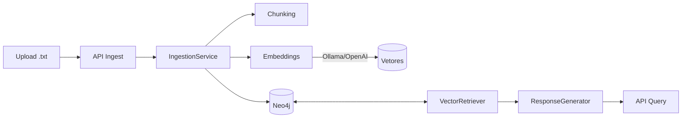
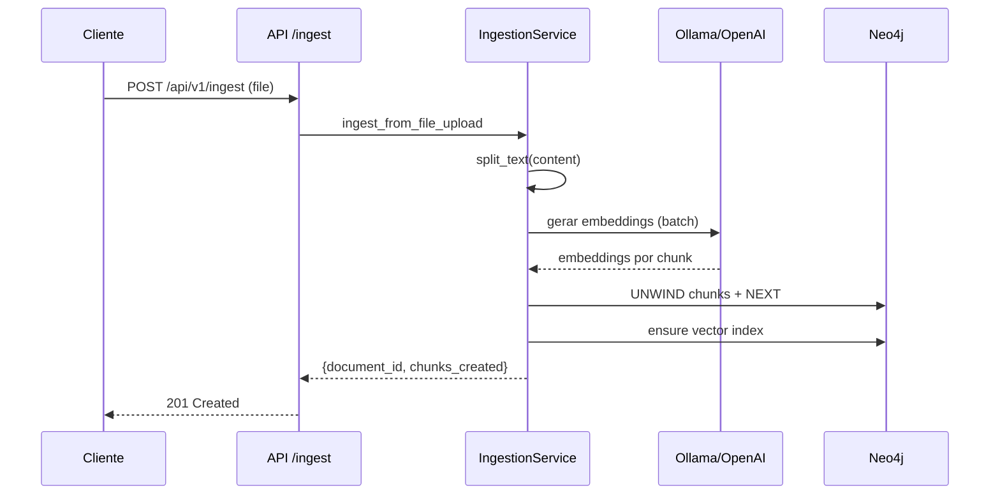
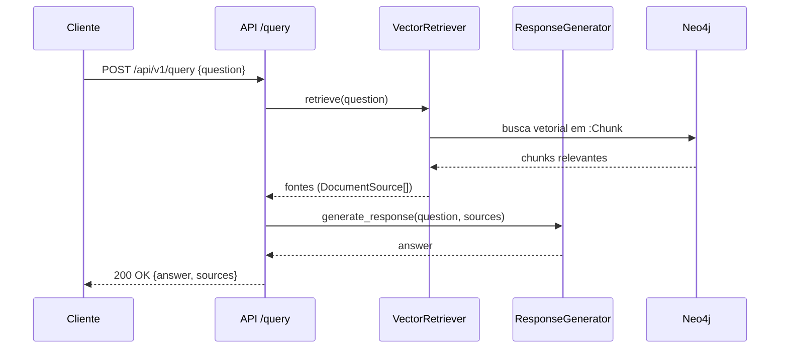

# Arquitetura do Sistema

Este documento detalha a arquitetura do sistema RAG local, cobrindo os componentes principais, fluxo de dados e decisões de design.

Diagrama (alto nível)
```
┌─────────────────┐    ┌─────────────────┐    ┌─────────────────┐
│   Documentos    │    │   Processamento │    │   Armazenamento │
│                 │    │                 │    │                 │
│ • TXTs          │───▶│ • Splitter      │───▶│ • Neo4j         │
│ • Webpages      │    │ • Embeddings    │    │ • Vetores       │
│ • APIs          │    │ • Metadados     │    │ • Relacionamentos│
└─────────────────┘    └─────────────────┘    └─────────────────┘
                                                       │
┌─────────────────┐    ┌─────────────────┐           │
│   Interface     │    │   Geração       │           │
│                 │    │                 │           │
│ • API REST      │◀───│ • LLM Local     │◀──────────┘
│ • Streamlit UI  │    │ • Prompt Eng.   │
└─────────────────┘    └─────────────────┘
```

Componentes
- Ingestão: carregamento, chunking (RecursiveCharacterTextSplitter), extração de metadados.
- Embeddings: Ollama (padrão via `/api/embed`) e OpenAI (opcional com `dimensions`).
- Armazenamento: Neo4j com nós `:Chunk` contendo `text`, `embedding`, `chunk_index`, `document_id` e relacionamento sequencial `(:Chunk)-[:NEXT]->(:Chunk)`.
- Índice Vetorial: `document_embeddings` com `vector.dimensions` e `cosine` (criado em `_ensure_vector_index`).
- Recuperação: busca vetorial sobre `:Chunk` (detalhes no retriever).
- Geração: LLM local (Ollama `/api/generate`) com contexto dos chunks recuperados.

Diagramas (Mermaid)

Componentes e dependências


Fluxo de ingestão


Fluxo de consulta


Internals do Retriever (resumo)
```mermaid
flowchart TD
  Q[question embedding] --> V[(document_embeddings index)]
  V -->|top-k chunks| C[Chunk nodes]
  C --> O{ordenar por score}
  O --> S[Sources (DocumentSource[])]
```

Fluxo de Dados
1) Upload/Input → parsing e chunking.
2) Embedding → geração de vetores por chunk (batch quando suportado).
3) Persistência → UNWIND de `chunks_data` em transação única + relações NEXT.
4) Consulta → embedding da pergunta + similaridade no índice vetorial.
5) Geração → síntese de resposta com fontes (chunks) relevantes.

Decisões de Design
- Neo4j como vector store para unificar grafo e vetores em um único backend.
- Fallback de embeddings com vetores zero em desenvolvimento para garantir robustez.
- Modo degradado quando Neo4j indisponível (pula persistência mas mantém fluxo).
- Flag `NEO4J_VERIFY_CONNECTIVITY` para flexibilizar a inicialização em ambientes com orquestração.

Infraestrutura e Modelos
- Python 3.9+, Neo4j 5.x (APOC recomendado).
- Ollama para LLM local e embeddings (`nomic-embed-text`, `qwen`/`gemma` etc.).
- OpenAI opcional para embeddings (configurar `OPENAI_API_KEY` e `OPENAI_EMBEDDING_DIMENSIONS`).

Estrutura do Projeto (resumo)
```
src/
  api/                 # FastAPI endpoints
  application/services # IngestionService e serviços
  retrieval/           # Retriever vetorial
  generation/          # Resposta/LLM
  config/              # Settings
  ui/                  # Streamlit
scripts/               # utilitários (clear_database.py)
docs/                  # documentação
```
