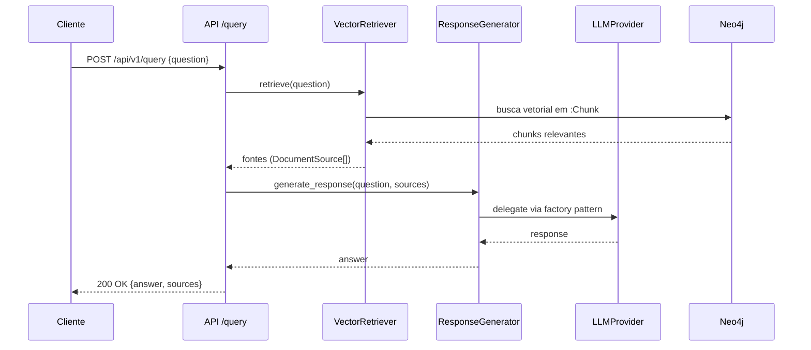

# Consulta (Query)

Endpoint
- `POST /api/v1/query`

Payload (JSON)
- `question`: string com a pergunta do usuário (obrigatória)

Resposta
- `answer`: texto gerado
- `sources`: lista de trechos (texto e score) usados na resposta
- `question`: eco da pergunta

Notas
- A recuperação usa busca vetorial sobre nós `:Chunk` no Neo4j
- A geração usa sistema flexível de provedores LLM (configurável via `LLM_PROVIDER`)

Fluxo (Mermaid)

