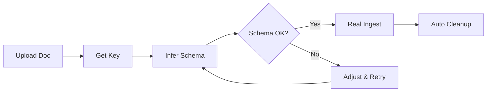

# História 7: Upload de Documento para Inferência de Schema

## 🎯 Objetivo
Criar um sistema que permita upload de documentos, extração e armazenamento temporário do texto em memória, e geração de chave de consulta para inferência de schema, eliminando a necessidade de passar texto diretamente na API.

## 📋 Contexto
Atualmente, o endpoint `/api/v1/schema/infer` requer que o texto seja enviado diretamente no payload JSON. Isso apresenta limitações:
- **Segurança**: Textos sensíveis trafegam pela rede
- **Tamanho**: Limitações de payload para documentos grandes
- **UX**: Usuário precisa extrair texto manualmente
- **Logs**: Textos podem aparecer em logs de sistema

## 🎯 Casos de Uso
1. **Upload Seguro**: Fazer upload de documento (.txt/.pdf) sem expor conteúdo
2. **Análise Prévia**: Analisar schema antes da ingestão completa
3. **Documentos Grandes**: Processar arquivos maiores que limite de JSON
4. **Reutilização**: Usar mesma chave para múltiplas análises
5. **Auditoria**: Rastrear análises sem expor conteúdo

## 📝 História do Usuário
**Como** desenvolvedor integrador do sistema RAG  
**Eu quero** fazer upload de um documento e receber uma chave temporária  
**Para que** eu possa usar essa chave para inferir schema sem expor o texto  
**E** ter controle sobre quando o documento é removido da memória

## ✅ Critérios de Aceitação

### AC1: Endpoint de Upload para Schema
- **Dado** que existe um endpoint `POST /api/v1/schema/upload`
- **Quando** envio um arquivo (.txt ou .pdf)
- **Então** recebo uma chave única (UUID) e metadados do arquivo
- **E** o texto é extraído e armazenado temporariamente em memória

### AC2: Inferência via Chave
- **Dado** que tenho uma chave válida de um upload
- **Quando** chamo `POST /api/v1/schema/infer` com a chave
- **Então** recebo o schema inferido sem precisar enviar o texto
- **E** posso configurar `max_sample_length`

### AC3: Gestão de Memória
- **Dado** que documentos são armazenados em memória
- **Quando** um documento não é usado por 30 minutos
- **Então** ele é automaticamente removido da memória
- **E** tentativas de uso retornam erro 404

### AC4: Endpoint de Limpeza Manual
- **Dado** que tenho uma chave válida
- **Quando** chamo `DELETE /api/v1/schema/documents/{key}`
- **Então** o documento é removido imediatamente da memória
- **E** tentativas subsequentes retornam erro 404

### AC5: Listagem de Documentos em Memória
- **Dado** que existem documentos em memória
- **Quando** chamo `GET /api/v1/schema/documents`
- **Então** recebo lista de chaves ativas com metadados
- **E** informações de tempo de expiração

### AC6: Validação e Segurança
- **Dado** que faço upload de arquivo inválido
- **Quando** o sistema processa a requisição
- **Então** recebo erro 415 (tipo não suportado)
- **E** nenhum dado é armazenado em memória

## 🔧 Especificação Técnica

### 1. Upload de Documento
```http
POST /api/v1/schema/upload
Content-Type: multipart/form-data

file: document.pdf
```

**Response (201):**
```json
{
  "key": "550e8400-e29b-41d4-a716-446655440000",
  "filename": "document.pdf",
  "size_bytes": 1048576,
  "text_length": 15847,
  "created_at": "2025-01-15T10:30:00Z",
  "expires_at": "2025-01-15T11:00:00Z",
  "file_type": "pdf"
}
```

### 2. Inferência via Chave
```http
POST /api/v1/schema/infer
Content-Type: application/json

{
  "document_key": "550e8400-e29b-41d4-a716-446655440000",
  "max_sample_length": 1000
}
```

**Response (200):**
```json
{
  "node_labels": ["Person", "Company", "Technology"],
  "relationship_types": ["WORKS_AT", "USES", "DEVELOPS"],
  "source": "llm",
  "model_used": "qwen3:8b",
  "processing_time_ms": 1250.5,
  "document_info": {
    "filename": "document.pdf",
    "text_length": 15847,
    "sample_used": 1000
  }
}
```

### 3. Listagem de Documentos
```http
GET /api/v1/schema/documents
```

**Response (200):**
```json
{
  "documents": [
    {
      "key": "550e8400-e29b-41d4-a716-446655440000",
      "filename": "document.pdf",
      "size_bytes": 1048576,
      "text_length": 15847,
      "created_at": "2025-01-15T10:30:00Z",
      "expires_at": "2025-01-15T11:00:00Z",
      "last_accessed": "2025-01-15T10:35:00Z"
    }
  ],
  "total_documents": 1,
  "memory_usage_mb": 15.2
}
```

### 4. Remoção de Documento
```http
DELETE /api/v1/schema/documents/550e8400-e29b-41d4-a716-446655440000
```

**Response (200):**
```json
{
  "message": "Document removed successfully",
  "key": "550e8400-e29b-41d4-a716-446655440000"
}
```

## 🏗️ Arquitetura de Implementação

### Cache Service (Novo)
```python
class DocumentCacheService:
    def __init__(self):
        self._cache: Dict[str, CachedDocument] = {}
        self._cleanup_task = None
    
    async def store_document(self, file_content: bytes, filename: str) -> str
    async def get_document(self, key: str) -> Optional[CachedDocument]
    async def remove_document(self, key: str) -> bool
    async def list_documents(self) -> List[DocumentInfo]
    async def cleanup_expired(self) -> int
```

### Modelos de Dados
```python
@dataclass
class CachedDocument:
    key: str
    filename: str
    text_content: str
    file_type: str
    size_bytes: int
    created_at: datetime
    last_accessed: datetime
    expires_at: datetime

class SchemaUploadResponse(BaseModel):
    key: str
    filename: str
    size_bytes: int
    text_length: int
    created_at: datetime
    expires_at: datetime
    file_type: str

class SchemaInferByKeyRequest(BaseModel):
    document_key: str
    max_sample_length: Optional[int] = 500
```

### Endpoints Implementados
1. `POST /api/v1/schema/upload` - Upload e cache
2. `POST /api/v1/schema/infer` - Inferência (suporta texto OU chave)
3. `GET /api/v1/schema/documents` - Listar cache
4. `DELETE /api/v1/schema/documents/{key}` - Remover do cache

## 🔒 Considerações de Segurança

### Gestão de Memória
- **TTL**: 30 minutos por padrão (configurável)
- **Cleanup**: Task automática a cada 5 minutos
- **Limite**: Máximo 100 documentos em cache simultâneo
- **Tamanho**: Máximo 50MB por documento

### Proteção de Dados
- **UUID seguro**: Chaves não-sequenciais geradas via `uuid4()`
- **Sem persistência**: Dados apenas em memória (não em disco)
- **Logs seguros**: Chaves loggadas, conteúdo jamais
- **Rate limiting**: Máximo 10 uploads por minuto por IP

### Validação
- **Tipos permitidos**: Apenas .txt e .pdf
- **Tamanho máximo**: 50MB por arquivo
- **Sanitização**: Validação rigorosa de content-type

## 🧪 Plano de Testes

### Testes Unitários
1. **DocumentCacheService**
   - Store/retrieve/remove operations
   - TTL e cleanup automático
   - Gestão de memória

2. **Modelos Pydantic**
   - Validação de uploads
   - Serialização/deserialização
   - Edge cases

### Testes de Integração
1. **Upload Workflow**
   - Upload → Cache → Infer → Cleanup
   - Diferentes tipos de arquivo
   - Erro handling

2. **Memory Management**
   - Expiração automática
   - Limpeza manual
   - Limites de capacidade

### Testes de Performance
1. **Concorrência**: Múltiplos uploads simultâneos
2. **Memória**: Consumo com documentos grandes
3. **Cleanup**: Performance da limpeza automática

## 📊 Definição de Pronto (DoD)
- [ ] DocumentCacheService implementado
- [ ] 4 novos endpoints funcionando
- [ ] Modelos Pydantic criados
- [ ] Cleanup automático funcionando
- [ ] Testes unitários > 95% cobertura
- [ ] Testes de integração passando
- [ ] Documentação completa
- [ ] Limite de memória respeitado
- [ ] Rate limiting implementado
- [ ] Logs de segurança configurados

## 🔄 Metodologia
- **TDD**: Testes primeiro
- **Security-first**: Proteção de dados sensíveis
- **Backward compatible**: Endpoint existente continua funcionando
- **Memory-efficient**: Gestão cuidadosa de recursos

## 💡 Benefícios Esperados
1. **Segurança**: Texto não trafega em APIs REST
2. **Performance**: Reutilização de extrações caras
3. **UX**: Upload simples de arquivos
4. **Escalabilidade**: Suporte a documentos grandes
5. **Auditoria**: Rastreabilidade sem exposição de dados

## 🎯 Fluxo de Uso

### Cenário Típico
1. **Upload**: `POST /schema/upload` → recebe chave
2. **Análise**: `POST /schema/infer` com chave → schema
3. **Decisão**: Se satisfeito, procede com ingestão real
4. **Limpeza**: `DELETE /schema/documents/{key}` ou expira automaticamente

### Integração com Ingestão Existente


## 🔧 Configuração

### Variáveis de Ambiente
```env
# Schema Cache Settings
SCHEMA_CACHE_TTL_MINUTES=30
SCHEMA_CACHE_MAX_DOCUMENTS=100
SCHEMA_CACHE_MAX_SIZE_MB=50
SCHEMA_CACHE_CLEANUP_INTERVAL_MINUTES=5

# Rate Limiting
SCHEMA_UPLOAD_RATE_LIMIT=10  # uploads per minute per IP
```

Esta implementação oferece um sistema robusto, seguro e eficiente para análise de schema sem comprometer a segurança dos dados!